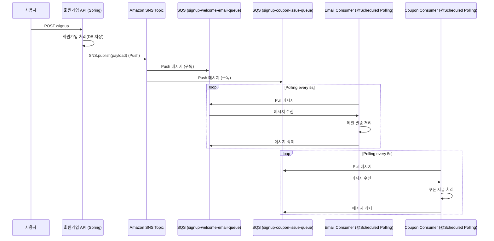

```mermaid
sequenceDiagram
    participant User as 사용자
    participant API as 회원가입 API (Spring)
    participant SNS as Amazon SNS Topic
    participant SQS_Email as SQS (signup-welcome-email-queue)
    participant SQS_Coupon as SQS (signup-coupon-issue-queue)
    participant EmailWorker as Email Consumer (@Scheduled Polling)
    participant CouponWorker as Coupon Consumer (@Scheduled Polling)

    User ->> API: POST /signup
    API ->> API: 회원가입 처리(DB 저장)
    API ->> SNS: SNS.publish(payload) (Push)
    SNS ->> SQS_Email: Push 메시지 (구독)
    SNS ->> SQS_Coupon: Push 메시지 (구독)
    
    loop Polling every 5s
        EmailWorker ->> SQS_Email: Pull 메시지
        SQS_Email ->> EmailWorker: 메시지 수신
        EmailWorker ->> EmailWorker: 메일 발송 처리
        EmailWorker ->> SQS_Email: 메시지 삭제
    end

    loop Polling every 5s
        CouponWorker ->> SQS_Coupon: Pull 메시지
        SQS_Coupon ->> CouponWorker: 메시지 수신
        CouponWorker ->> CouponWorker: 쿠폰 지급 처리
        CouponWorker ->> SQS_Coupon: 메시지 삭제
    end

```