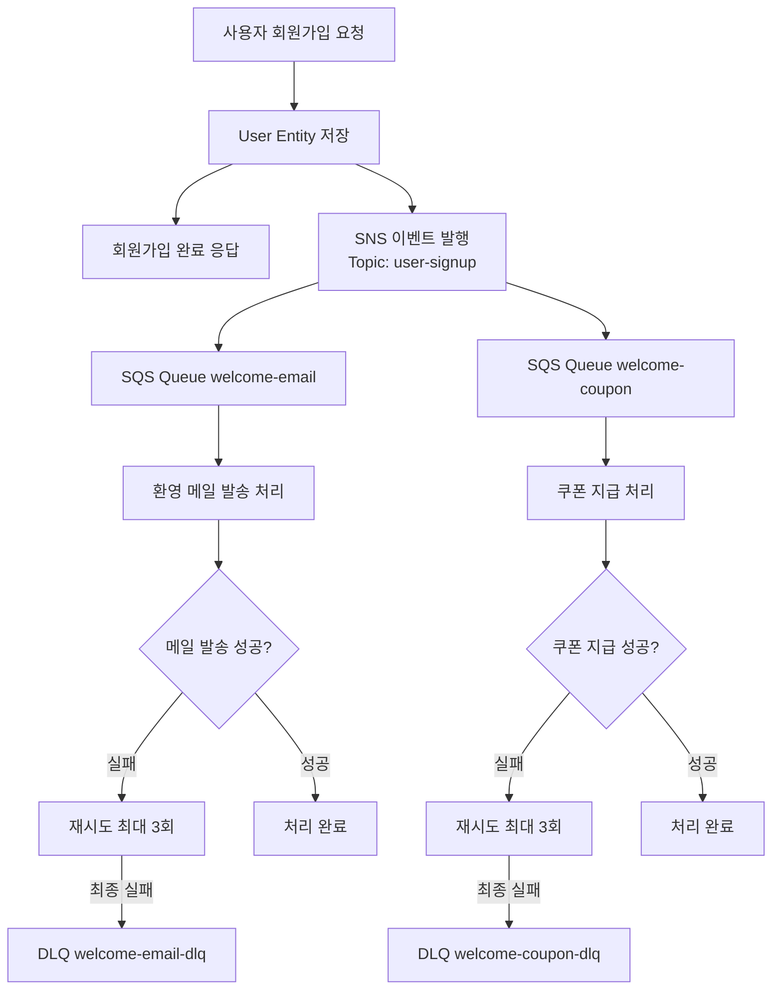

# 회원가입 알림 시스템 기술 구현 가이드

## 1. 개요

이 문서는 회원가입 완료 후 환영 메일 발송 및 쿠폰 지급을 위한 비동기 알림 시스템의 기술적 구현 내용과 개선 계획을 설명합니다.

### 1.1 목적

- 회원가입 이후 진행되는 환영 메일 발송 및 쿠폰 지급 과정을 자동화하고, 안정적으로 처리되도록 한다.
- 외부 시스템 문제로 인해 실패가 발생해도, 가능한 모든 방법을 통해 업무가 최종적으로 완료되도록 한다.
- 반복된 실패가 발생한 경우, 운영자가 확인하고 수동으로 처리할 수 있는 구조를 마련한다.
- 중요한 설정 정보는 코드 내부가 아니라 외부에서 안전하게 관리되도록 한다.

## 2. 기술 스택

### 2.1 현재 사용 중인 기술

- **Spring Boot**: 메인 프레임워크
- **Spring Cloud AWS**: AWS 서비스 연동
- **AWS SDK**: AWS 클라이언트
- **Spring Data JPA**: 데이터 영속성
- **MySQL**: 데이터베이스
- **Spring Cloud Config**: 설정 관리

### 2.2 추가 필요한 의존성

- **Spring Retry**: 재시도 메커니즘
- **Spring Actuator**: 헬스 체크 및 모니터링

## 3. 인프라 설정 (AWS)

### 3.1 현재 설정 상태

#### SNS Topic
- `user-signup`: 회원가입 이벤트 발행용

#### SQS Queues
- `signup-welcome-email`: 환영 메일 발송용
- `signup-welcome-coupon`: 쿠폰 지급용

### 3.2 추가 필요한 인프라

#### DLQ (Dead Letter Queue)
- `signup-welcome-email-dlq`: 메일 발송 실패 메시지 보관
- `signup-welcome-coupon-dlq`: 쿠폰 지급 실패 메시지 보관

#### CloudWatch 알람
- DLQ 메시지 수신 알람
- 처리 실패율 알람
- 큐 백로그 알람

## 4. 아키텍처 개요

현재 시스템은 SNS Fanout 패턴을 사용한 비동기 알림 처리 구조로 구현되어 있습니다:

## 5. 구현해야 할 기능 목록

### 5.1 높은 우선순위 (핵심 요구사항)

#### 5.1.1 회원가입과 알림 처리 분리
회원가입 처리와 알림 발송을 완전히 분리하여 알림 실패가 회원가입에 영향을 주지 않도록 구현

- [ ] SignUpService에서 회원가입 성공 후 SNS 이벤트 발행 로직 추가
- [ ] 비동기 이벤트 처리를 위한 `@Async` 및 `@TransactionalEventListener` 적용

#### 5.1.2 실제 메일 발송 및 쿠폰 지급 구현
현재 로그만 출력하는 상태에서 실제 외부 서비스 연동으로 변경

- [ ] 이메일 발송 서비스 구현
- [ ] 쿠폰 시스템 연동 API 구현

#### 5.1.3 DLQ (Dead Letter Queue) 구성
반복 실패한 메시지를 안전하게 보관하고 관리할 수 있는 구조 구현

- [ ] 각 SQS 큐에 대한 DLQ 설정 (AWS 콘솔 또는 Terraform)
- [ ] 최대 재시도 횟수 설정 (3회)

### 5.2 중간 우선순위 (안정성 강화)

#### 5.2.1 재시도 메커니즘
외부 서비스의 일시적 장애에 대응하기 위한 지능적 재시도 구현

- [ ] Spring Retry를 활용한 지수 백오프 재시도 적용
- [ ] 재시도 실패 시 DLQ로 메시지 전송

#### 5.2.2 외부 서비스 장애 감지 및 대응
외부 서비스 상태를 모니터링하고 장애 시 자동 대응

- [ ] 외부 서비스 상태 모니터링 스케줄러 구현
- [ ] 서비스 복구 시 자동 처리 재개 기능

#### 5.2.3 실패 처리 및 관리 시스템
실패한 작업을 체계적으로 관리하고 운영자가 쉽게 처리할 수 있는 시스템

- [ ] 실패한 작업 저장을 위한 `FailedNotification` 엔티티 구현
- [ ] 관리자용 실패 작업 조회 API 구현

### 5.3 낮은 우선순위 (운영 편의성)

#### 5.3.1 모니터링 및 알람
시스템 상태를 실시간으로 모니터링하고 문제 발생 시 즉시 알림

- [ ] 실패율 기반 알람 설정
- [ ] 큐 백로그 모니터링 및 알람

#### 5.3.2 설정 관리 개선
Spring Cloud Config를 완전히 활용한 중앙 집중식 설정 관리

- [ ] Config Server와 Notification 서비스 연동 완료
- [ ] 환경별 설정 파일 정리 및 표준화
- [ ] 설정 변경 시 무중단 반영 (`@RefreshScope` 적용)
- [ ] 설정 변경 이력 관리

## 6. 예외 처리 및 실패 시나리오

### 6.1 회원가입 완료 후 알림 발송 실패

#### 시나리오 1: SNS 발행 실패
- **상황**: AWS SNS 서비스 장애 또는 네트워크 문제
- **현재 처리**: SnsException catch 후 로그 출력 및 재던짐으로 회원가입 전체 실패
- **개선 방안**: 별도 트랜잭션으로 분리하여 회원가입은 성공, 알림은 별도 처리
- **복구 방법**: 실패한 회원가입 이벤트를 별도 테이블에 저장 후 배치로 재처리

#### 시나리오 2: 환영 메일 발송 실패
- **상황**: 이메일 서비스 장애, 잘못된 이메일 주소, 발송 한도 초과
- **처리 방식**: 
  1. 1차 실패 시 1분 후 재시도
  2. 2차 실패 시 5분 후 재시도  
  3. 3차 실패 시 DLQ로 전송
- **복구 방법**: DLQ 메시지를 관리자가 확인 후 수동 재처리 또는 배치 처리

#### 시나리오 3: 쿠폰 지급 실패
- **상황**: 쿠폰 서비스 장애, 쿠폰 재고 부족, 중복 지급 방지
- **처리 방식**: 환영 메일과 동일한 재시도 정책 적용
- **복구 방법**: 실패 원인별 분류하여 자동/수동 재처리 결정

## 7. 시스템 개선 방안 및 베스트 프랙티스

### 7.1 메시지 처리 성능 최적화

#### 개선 방안
1. **배치 처리 도입**
   - **방법**: SQS 배치 수신 (최대 10개)을 활용한 처리량 증대
   - **장점**: 처리량 10배 증가, 비용 절감
   - **단점**: 구현 복잡성 증가, 실패 처리 복잡화
   - **점수**: 8/10

2. **메시지 압축**
   - **방법**: JSON 메시지 GZIP 압축 후 전송
   - **장점**: 네트워크 비용 절감, 전송 속도 향상
   - **단점**: CPU 사용량 증가, 디버깅 어려움
   - **점수**: 6/10

3. **연결 풀링**
   - **방법**: AWS 클라이언트 연결 풀 최적화
   - **장점**: 지연시간 감소, 처리량 향상
   - **단점**: 메모리 사용량 증가
   - **점수**: 9/10

**베스트 프랙티스**: 연결 풀링 + 배치 처리 조합

### 7.2 보안 및 컴플라이언스 강화

#### 개선 방안
1. **메시지 암호화**
   - **방법**: SQS 메시지 KMS 암호화 적용
   - **장점**: 데이터 보안 강화, 컴플라이언스 충족
   - **단점**: 처리 지연, 비용 증가
   - **점수**: 8/10

2. **IAM 역할 세분화**
   - **방법**: 서비스별 최소 권한 IAM 역할 적용
   - **장점**: 보안 위험 최소화, 권한 관리 명확화
   - **단점**: 관리 복잡성 증가
   - **점수**: 9/10

3. **데이터 마스킹**
   - **방법**: 로그 및 모니터링에서 개인정보 자동 마스킹
   - **장점**: 개인정보 보호, 규정 준수
   - **단점**: 디버깅 어려움, 구현 복잡성
   - **점수**: 7/10

**베스트 프랙티스**: IAM 역할 세분화 + 메시지 암호화

### 7.3 비용 최적화

#### 개선 방안
1. **큐 정책 최적화**
   - **방법**: 메시지 보존 기간, 가시성 타임아웃 최적화
   - **장점**: 운영 비용 절감, 리소스 효율성
   - **단점**: 튜닝 시간 필요
   - **점수**: 9/10

2. **Reserved 인스턴스 활용**
   - **방법**: 예측 가능한 워크로드에 대해 예약 인스턴스 적용
   - **장점**: 최대 75% 비용 절감
   - **단점**: 유연성 감소, 장기 계약
   - **점수**: 8/10

3. **스팟 인스턴스 활용**
   - **방법**: 배치 처리 작업에 스팟 인스턴스 활용
   - **장점**: 최대 90% 비용 절감
   - **단점**: 중단 위험, 가용성 이슈
   - **점수**: 6/10

**베스트 프랙티스**: 큐 정책 최적화 + Reserved 인스턴스 활용
